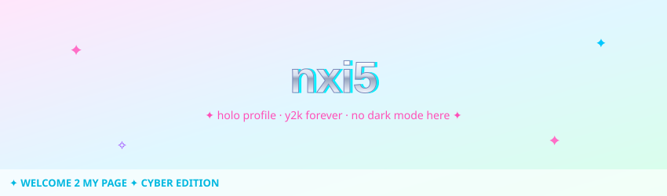
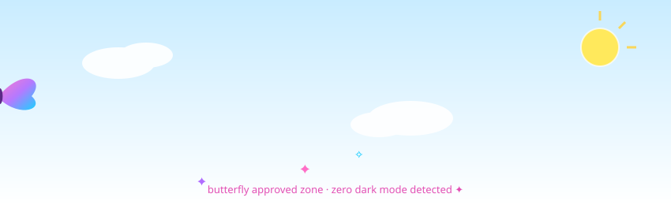
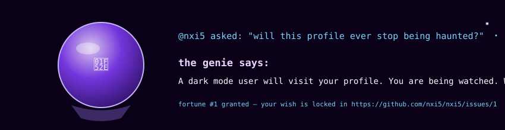
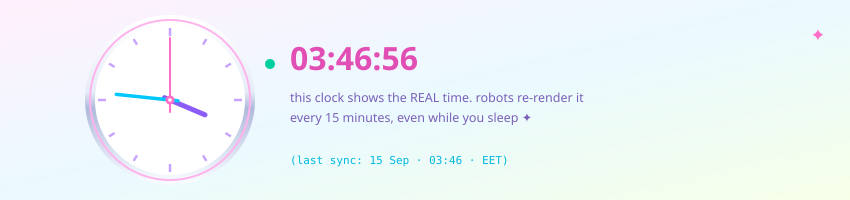



**this profile is haunted. the robots keep it alive.**

## 👽 they took the stars

## 🔮 feed the genie *(interactive — no one else has this)*

**How it works:** open an issue on [nxi5/nxi5](https://github.com/nxi5/nxi5/issues/new) and ask anything.
A robot genie reads it, grants you a fortune **as a comment**, and then physically mutates
this profile's crystal ball with your name + your fortune. You become part of my GitHub profile. Permanently.

## ⏰ the clock is real

A scheduled robot re-renders this clock with the **actual current time** every 15 minutes,
even when nobody is watching. The second hand ticks on its own.

## 🛍️ what i'm building

**[Shopify Hub](https://github.com/nxi5/shopify-hub)** — the missing GUI for Shopify theme development:
multi-store sessions with one-click switching, unlimited parallel `theme dev` servers,
visual theme push/pull. Built with Tauri + Rust + Svelte. [→ check it out](https://github.com/nxi5/shopify-hub)

---

*the UFO took the stars. the genie took the issues. the clock never sleeps.*

